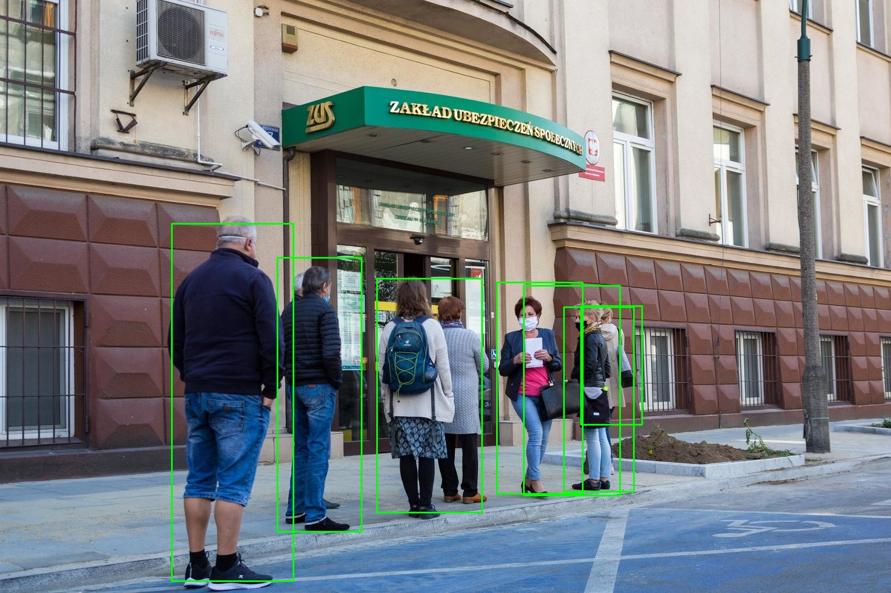

# Person Detection API 
An AI-powered system for detecting people in images, built with Python, FastAPI, Celery, RabbitMQ, and Redis.
This project provides asynchronous image processing with scalable task queues, making it ideal for video surveillance, smart security systems, and real-time monitoring solutions.

## Key Features
- Asynchronous image processing using Celery + RabbitMQ
- People detection powered by TensorFlow
- REST API for easy integration (FastAPI + Swagger UI)
- Real-time monitoring of workers and queue status
- Horizontal scalability – run multiple parallel workers

## Installation:
1. Clone the repository
2. In the /models/ folder, add the file "frozen_inference_graph.pb" (https://drive.google.com/file/d/1Qc30uGzBU2POIiGgAzSn71XyUP49Gksv/view?usp=share_link)
3. Remember to install Redis (https://redis.io/docs/latest/operate/oss_and_stack/install/install-redis/)

## Launch:
1. IIn the terminal, run the following command to start Redis: 'redis-server'
2. n the terminal, run the following command to start FastAPI: 'uvicorn main:app --host 127.0.0.1 --port 8000 --reload'
3. In the terminal, run the following command to start Celery: 'celery -A tasks worker --loglevel=info --concurrency=2 -Q image_queue' (concurrency=x defines the number of parallel workers)

## Testing:
1. http://127.0.0.1:8000/docs - allows you to check the API.
2. "Celery -A Active Inspection Tasks" - allows you to check worker statuses in the terminal.

### How It Works
1. How It Works
2. Send an image to the API (POST /detect)
3. The request is queued in RabbitMQ
4. A Celery worker picks up the job and runs the TensorFlow model
5. The detection results are sent back via the API

This project is licensed under the MIT License – free to use, modify, and distribute.
